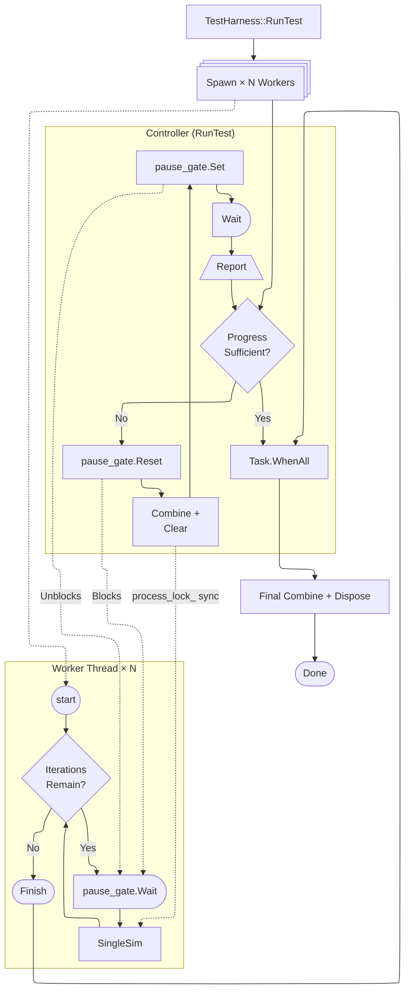

# About

`MTMC` which stands for _**M**ulti-**T**hreaded **M**onte-**C**arlo_, is a set of utilities I developed for
doing a long-running simulation with abstractions over the multi-threaded orchestration.

### Components

- SimulationObject
- TestHarness
- SimulationConfig

## SimulationObject

This will be the core object that is simulated. Containing the simulated data and the methods of:

- `SingleSim`
- `Combine`
- `Clear`

The parent class mostly just adds in a _thread-safe_ wrapper over these three functions when it will
be called by [`TestHarness`](#testharness).

### Example

Simulating consecutive 50/50 up to 100.

```cs
using MMOR.NET.MTMC;
using MMOR.NET.Statistics;

public class SomeSimulation : SimulationObject<SomeSimulation> {
  IRandom rng_;
  RunningStatistics stats;

  public SomeSimulation(IRandom rng) {
    rng_ = rng;
    stats = new();
  }

  public override void SingleSim() {
    int consecutives = 0;
    while (rng_.NextUInt() < (uint.MaxValue >> 1)) {
      if (++consecutives == 100)
        break;
    }
    stats.Push(consecutives);
  }

  public override void Combine(SomeSimulation add_data) {
    stats.Push(add_data.stats);
  }

  public override void Clear() {
    stats.Clear();
  }
}
```

## TestHarness

### Diagram


