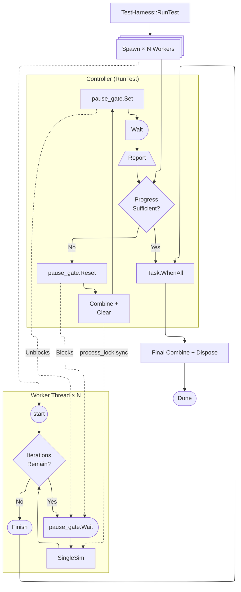

# Simplified Flowchart

A simplified overview of the logic flow:

```mermaid
---
config:
  layout: elk
---
flowchart TD
  Start["TestHarness::RunTest"] --> Spawn
  Spawn@{ shape: processes, label: "Spawn × N Workers" }
  Spawn --> Run
  Spawn -.-> WStart

  subgraph Controller["Controller (RunTest)"]
    Run@{ shape: diamond, label: "Progress<br/>Sufficient?" }
    Run -->|No| Pause["pause_gate.Reset"]
    Pause --> Collect["Combine +<br/>Clear"]
    Collect --> Unpause["pause_gate.Set"]
    Unpause --> Wait@{ shape: delay, label: "Wait" }
    Wait --> Report@{ shape: trap-b, label: "Report" }
    Report --> Run
    Run -->|Yes| WaitAll["Task.WhenAll"]
  end

  subgraph Worker["Worker Thread × N"]
    WStart@{ shape: circle, label: "start" } --> WLoop
    WLoop@{ shape: diamond, label: "Iterations<br/>Remain?" }
    WLoop -->|Yes| WGate@{ shape: delay, label: "pause_gate.Wait" }
    WGate --> WSim["SingleSim"]
    WSim --> WLoop
    WLoop -->|No| WFinish@{ shape: stadium, label: "Finish" }
  end

  Pause -.->|Blocks| WGate
  Unpause -.->|Unblocks| WGate
  Collect -.->|process_lock sync| WSim
  WFinish --> WaitAll
  WaitAll --> Final["Final Combine + Dispose"]
  Final --> Done@{ shape: stadium, label: "Done" }

```
